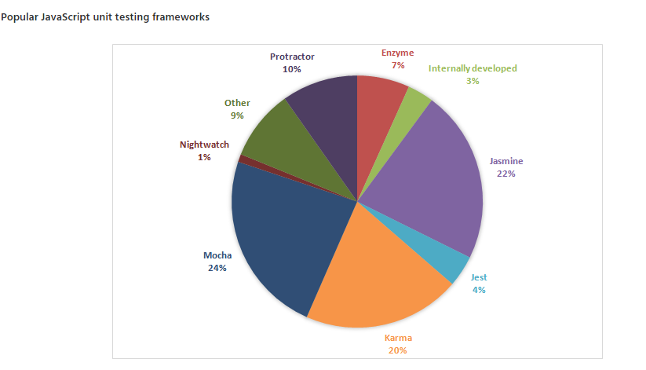
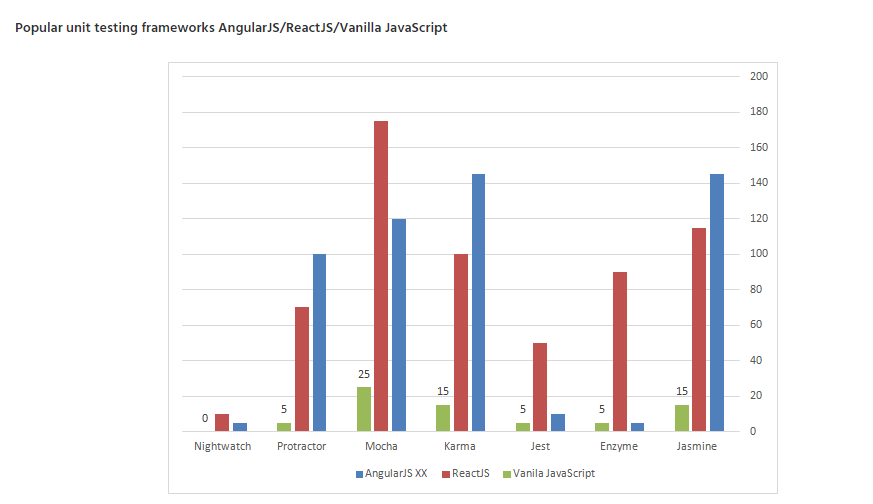
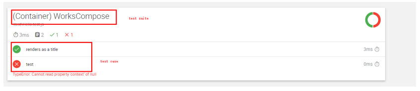
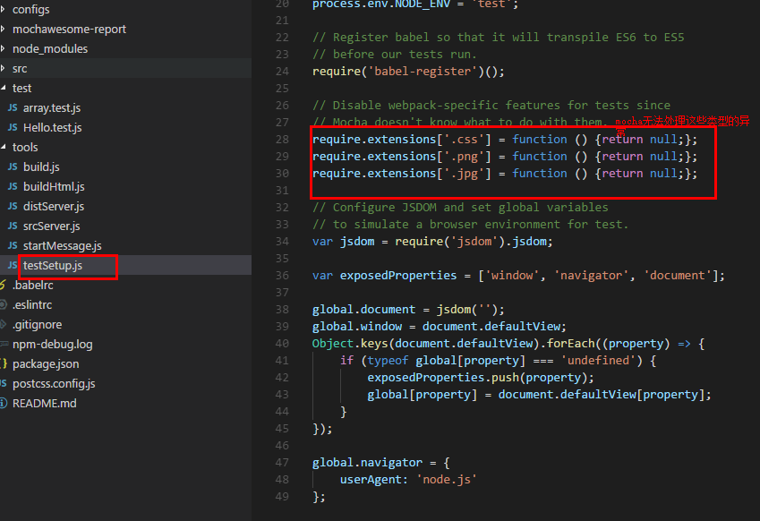
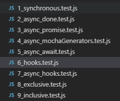
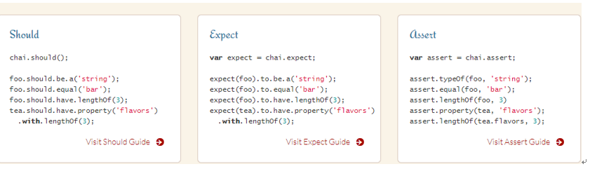

# 1 为什么要进行代码测试
- 节约时间<br>
原本开发每修改一次代码，就需要从头到尾的测试，现在程序员每修改一次代码，只需要执行一遍测试用例，即可完成测试。
- 便于代码功能质量提高<br>
程序员写的代码，黑盒测试是无法将所有代码逻辑测试完毕，因此出现了单元测试的。尽量覆盖代码逻辑，提高代码质量。
- 便于开发过失误操作<br>
避免在项目进行二次，三次迭代过程中，可能不小心改到不该改的地方，自己却不知道。
- 便于回归测试<br>
当进行迭代后，只需要跑一次测试用例，而不是页面一个一个去对比查找问题。

缺点：会增加很多代码，增加代码工作量。

# 2 TDD and BDD
- TDD:Test Drive Development<br>
先针对每个功能点抽象出接口代码，然后编写单元测试代码，接下来实现接口，运行单元测试代码，循环此过程，直到整个单元测试都通过。这一点和敏捷开发有类似之处。
对自己而言的作用：不只是为了不让别人觉得你写的代码有多糟糕，而是避免你错误地认为自己已经完成了编码，却留下一大堆Bug

- BDD:Behavior Drive Development<br>
BDD会从业务目标着手，作用是把利益关系人、交付团队等不同方面的项目相关人员集中到一起，形成共同的理解，共同的价值观以及共同的期望值。与TDD相比更接近人的思考方式。有人认为它是验收测试。

# 3 技术选型
https://blog.testproject.io/2016/09/01/front-end-development-unit-test-automation-trends2/
这边文章分析了当前前端测试框架的欢迎程度。下面是两个重要图片。<br>
<br>
<br>

最终我选择：Mocha+ Chai + Sinon +Enzyme+ jsdom
- mocha：一个JS的测试框架，类似于Java中的Junit、Python中的nose。
- chai:是一个单元测试的验证框架，它有3种不同形式的校验：expect、should和assert。
- sinon: 它可以对任何对象进行mock，不用再先解决一堆依赖和环境问题，把精力集中在要测试的单元上来编写 test case ，同时也缩短测试用例执行的时间，做到最小化测试。
- enzyme:是专门用于测试React的一种三方库，对（react-addon-test-utils）进行了封装。
- jsdom: 虚拟运行环境。不依赖浏览器为基础的测试运行器.它将会使用纯javascirpt创建一个假DOM,这样做让我们的测试更加快速。

# 4 环境搭建
mochawesome:用于生成漂亮的报告。
babel-register: 能够使用 ES6 编写测试，需要在运行前对代码进行转译
- 安装包
```javascript
npm install mocha –save-dev
npm install chai –save-dev
npm install sinon –save-dev
npm install mochawesome –save-dev
npm install babel-register –save-dev
```
- 启动命令

--reporter mochawesome : html报告
```javascript
"test": "mocha -t 2000000 --compilers js:babel-register --recursive --reporter mochawesome tools/testSetup.js test/**/*.js ",
"test:watch": "npm run test -- --watch"
```
--reporter spec: 控制台报告
```javascript
"test": "mocha -t 2000000 --compilers js:babel-register --recursive --reporter spec tools/testSetup.js test/**/*.js ",
"test:watch": "npm run test -- --watch"
```
网页生成测试报告：<br> 
<br>

- 命令解释：
--compilers js:babel-register ：通过es6编写测试代码
--recursive：测试文件递归测试，默认只测试一级目录
--reporter spec ：报告种类，spec 是在控制台显示 
--reporter mochawesome ：报告种类，生成漂亮的html报告
tools/testSetup.js：jsdom的配置文件
\"test/**/*.test.js\" ： 测试文件目录

- jsdom的文件<br>
<br>

# 5 Mocha测试实例
- 同步测试(没有异步请求的测试)
- 异步测试
    注意坑：调用接口时使用mockjs会报错，必须使用服务器。
    1.	使用done callback函数。
    2.	直接返回promise方式
    3.	Mocha-generators方式（我推荐）
    4.	4.async-await方式（我推荐）
- 测试用例钩子
    1. 执行顺序
    2. description hooks作用（当钩子函数抛出异常，能够很快定位哪里出现问题）
    3. 异步钩子
- only,skip： 过滤测试用例进行执行<br>

详细测试例子请见demo:<br>
<br>

# 6 Chai断言库
Chai是一个单元测试的验证框架，它有3种不同形式的校验：expect、should和assert。
expect和should的方式让写出来的测试代码更像自然语言，让业务人员也可以看懂。
assert方式是传统单元测试断言的方式，如果以前习惯写Java的单元测试会对这种方式比较熟悉。
<br>

详细例子请见demo：testChai目录

# 7 Enzyme
Enzyme是专门用于测试react组件的。提供了三种测试方法。
- Shallow: shallow方法就是官方的shallow rendering的封装,是浅渲染，不会间接地宣称子组件的行为。
- Render: 方法将React组件渲染成静态的HTML字符串，然后分析这段HTML代码的结构，返回一个对象。它跟shallow方法非常像. 它是完整的DOM渲染。适用于需要完整的生命周期才能完全测试组件的情况。
- Mount: mount方法用于将React组件加载为真实DOM节点，会渲染子组件。
## 7.1 react组件测试方式
对react的测试：是对我们的Reac应用渲染什么以及它如何响应用户交互的断言过程。可以从三方面入手：单元测试，功能测试，集成测试。
- react组件单元测试<br>
给定状态和属性, 输出是否符合我们对虚拟 dom 中 应该 的期望。对单一无状态选择shallow。
- React组件集成测试<br>
集成测试由于是由子组件构成，变动较大，维护成本相对较高。所以我们多做小巧的单元测试，少做集成测试。当需要测试生命周期，子组件的行为使用mount进行集成测试（渲染所有子组件,例如container）。如果想高性能地测试子组件，对生命周期不怎么关注（例如有子组件的component），就使用render().
- react组件功能测试<br>
重点是测试组件的行为。例如当用户登录后，显示一个LogOut按钮。没有登录显示Login按钮。可以集成selenium测试库进行真正浏览器模拟。

测试粒度选择<br>
不能太细，太细会增加太多测试代码，会导致维护测试代码的困难。不能太粗，不然没有任何意义。在选择测试粒度时，我建议将重要正常流程进行测试。异常流程类型太多，难以维护。

## 7.2 使用Enzyme测试react
单元测试的好坏在于“单元”而不在“测试”。如果系统没有单元可言，就无法单元测试。可能只有进行集成测试与系统测试。
- 单元划分规则<br>
摆脱mock（如Sinon库），只需依靠传参，减少依赖。
- 好的单元划分意义<br>
易重构，可提高测试对业务的覆盖率，易学易用，减少测试代码编写。
- 单元测试坏处<br>
花费时间较多，生产成本高。如果项目不需要长期维护，并且时间较紧，就不需要进行单元测试

## 7.3 react 测试具体分析
Redux通过stateview,view->state.只要view改变，state一定会改变，反之亦然。掌握这一特性，我们可以直接测试下面几点：
- 各个单独组建能够正常显示DOM元素（渲染正确，输出正确）
- 如果state改变，我们确认相应view发生的变化(事件正确，页面view状态正确)
- 如果view改变，我们确认state数据是否存入store(数据源更新正确)
- 工具箱测试（例如边界测试）
备注：使用sinon测试callbacks函数。不要在组件中测试业务逻辑。

[react相关测试驱动开发文章](https://semaphoreci.com/community/tutorials/getting-started-with-tdd-in-react)
让你对自己的代码有自信，当组装代码时候可以相信它能工作很好。

# 8 Sinon
Sinon是一个测试实用程序库, 它为我们提供了一种编写间谍(spies)、存根(stubs)和 模拟(mock) 的方法