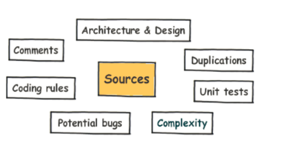
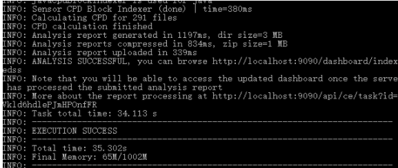
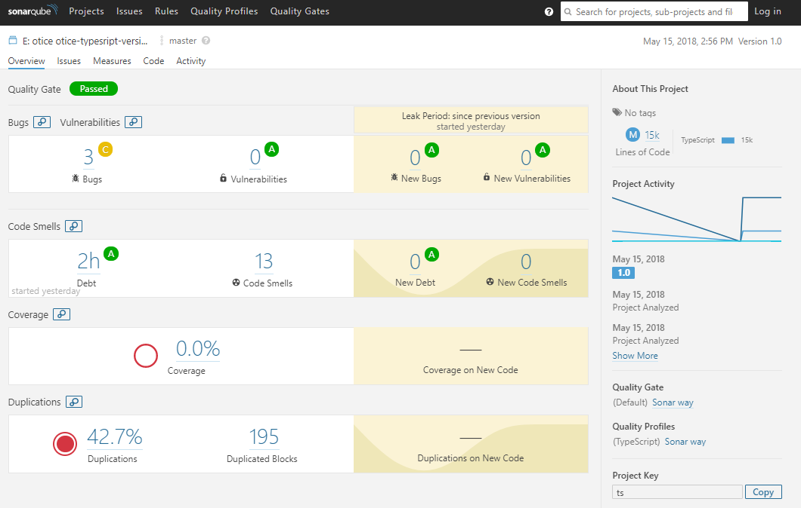
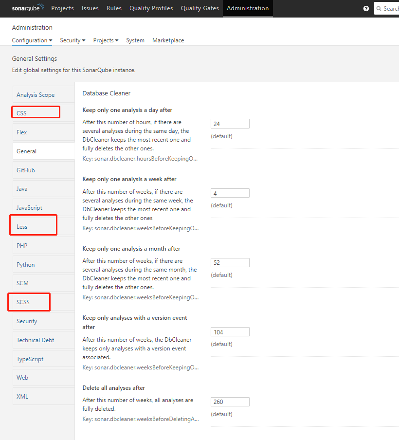

SonarQube（简称Sonar）是管理代码质量的开放平台，它可以快速地对代码质量进行分析，并给出合理的解决方案，提高管理效率，保证代码质量。通过插件的形式，可以支持包括java,C#,C/C++,PL/SQL,Cobol,JavaScrip,Groovy等等二十几种编程语言的代码质量管理与检测。
# 1 SonarQube的工作原理
Sonar并不是简单地将各种质量检测的刚刚那局的结果（如FindBugs,PMD等）直接展现给客户，而是通过不同的插件算法对这些结果进行再加工，最终以量化的方式衡量代码的质量从而方便地对不同规模和种类的工程进行相应的代码质量管理。

SonarQube在进行代码质量管理时，会从图示的七个经纬度来分析项目质量。<br>
<br>
- 糟糕的复杂度分布：文件、类、方法等，如果复杂度过高将难以改变，这会使得开发人员难以理解它们，且如果没有自动化的单元测试，对于程序中的任何组件的改变都将可能导致需要全面的回归测试。
- 重复：显然程序中包含大量复制粘贴的代码是质量低下的。sonar可以展示源码中重复严重的地方
- 缺乏单元测试：sonar可以很方便地统计并展示单元测试覆盖率
- 没有代码标准：sonar可以通过PMD,CheckStyle,Findbugs等等代码规则检测工具规范代码编写
- 没有足够的或者过多的注释： 没有注释将使代码可读性变差，特别是当不可避免地出现人员变动时，程序的可读性将大幅下降。而过多的注释又会使得开发人员将精力过多地花费在阅读注释上，亦违背初衷。
- 潜在的bug：  sonar可以通过PMD,CheckStyle,Findbugs等等代码规则检测工具检测出潜在的bug
- 糟糕的设计： 通过sonar可以找出循环，展示包与包、类与类之间的相互依赖关系；可以检测自定义的架构规则；通过sonar可以管理第三方的jar包，可以利用LCOM4检测单个任务规则的应用情况；检测耦合。

SonarQube 可以支持 25+ 种编程语言，针对不同的编程语言其所提供的分析方式也有所不同:
- 对于所有支持的编程语言，SonarQube 都提供源了代码的静态分析功能；
- 对于某些特定的编程语言，SonarQube 提供了对编译后代码的静态分析功能，比如 java 中的 class file 和 jar 和 C# 中的 dll file 等；
- 对于某些特定的编程语言，SonarQube 还可以提供对于代码的动态分析功能，比如 java 和 C# 中的单元测试的执行等。

SonarQube 的服务架构:<br>
<br>
远程客户机可以通过各种不同的分析机制，从而将被分析的项目代码上传到 SonarQube server 并进行代码质量的管理和分析，SonarQube 还会通过 Web API 将分析的结果以可视化、可度量的方式展示给用户。

# 2 SonarQue安装(window)

前置条件
- JDK 1.8(1.7不支持)
- Mysql数据库
下载地址：
- SonarQue：http://www.sonarqube.org/downloads/
- SonarQube Scanner: https://docs.sonarqube.org/display/SCAN/Analyzing+with+SonarQube+Scanner

SonarQue安装：
- 解压
- 进入 ..\sonarqube-7.1\bin\windows-x86-64,启动StartSonar.bat，访问http://localhost:9000
- 创建mysql数据库：（创建sonar数据库,默认账号链接）
```javascript
CREATE DATABASE sonar CHARACTER SET utf8 COLLATE utf8_general_ci;
```
- 修改sonarqube-7.1\conf\sonar.properties
```javascript
sonar.jdbc.url=jdbc:mysql://localhost:3306/sonar?useUnicode=true&characterEncoding=utf8&rewriteBatchedStatements=true&useConfigs=maxPerformance
sonar.jdbc.username=root
sonar.jdbc.password=123456
sonar.sorceEncoding=UTF-8
sonar.login=admin
sonar.password=admin
```
- 重启：需要关闭bat窗口，并在进程中关闭java.exe（不然不能再重启）

SonarQube Scanner安装：
- 解压
- 修改sonar-runner.properties(根据实际使用数据库情况取消相应注释)
```javascript
#Configure here general information about the environment, such as SonarQube DB details for example  
#No information about specific project should appear here  
#----- Default SonarQube server  
sonar.host.url=http://localhost:9000  
#----- PostgreSQL  
#sonar.jdbc.url=jdbc:postgresql://localhost/sonar  
#----- MySQL  
sonar.jdbc.url=jdbc:mysql://localhost:3306/sonar?useUnicode=true&characterEncoding=utf8  
#----- Oracle  
#sonar.jdbc.url=jdbc:oracle:thin:@localhost/XE  
#----- Microsoft SQLServer  
#sonar.jdbc.url=jdbc:jtds:sqlserver://localhost/sonar;SelectMethod=Cursor  
#----- Global database settings  
sonar.jdbc.username=sonar  
sonar.jdbc.password=sonar  
#----- Default source code encoding  
sonar.sourceEncoding=UTF-8  
#----- Security (when 'sonar.forceAuthentication' is set to 'true')  
sonar.login=admin  
sonar.password=admin  
```
- 修改环境变量（SONAR_SCANNER=D:\Program Files\sonar-scanner-3.1.0.1141-windows， 并添加到Path：%SONAR_SCANNER%/bin）
- cmd窗口查看安装情况（输入sonar-scanner命令检查是否安装成功）

# 3 分析源码

当使用 SonarQube3.6 对某一个项目进行代码质量管理时，通常可以采用三种不同的方法来发起代码分析，分别为 Analyzing with SonarQube Runner、，Analyzing with SonarQube Ant Task 和 Analyzing with Maven 方法。这三种方法的主要区别是 , 它们分别适用于不同架构和组织形式的项目，并且其相应的配置文件的写法也不尽相同。

通常我们会推荐使用 SonarQube Runner（我使用的时Scanner,方式是一样的） 这种方式，因为该方法适用于所有不同架构的项目，包括没有使用任何源代码管理工具的项目形式，以及使用各种不同代码管理工具（SVN、Git、ClearCase 等）和编译工具（ant，maven）的项目形式，它都能够适用。在使用该方式进行分析时步骤如下：

前置条件
- 已安装SonarQube Scannerr且环境变量已配置，即sonar-scanner命令可在任意目录下执行
- 在sonar-scanner的sonar-scanner.properties配置文件中配置基本的信息, 其中的jdbc的配置需要与SonarQuebe的配置文件一致
```javascript
#----- Default SonarQube server
sonar.host.url=http://localhost:9000

#----- Default source code encoding
sonar.sourceEncoding=UTF-8

sonar.jdbc.username=root 
sonar.jdbc.password=123456
sonar.jdbc.url=jdbc:mysql://localhost:3306/sonar?useUnicode=true&characterEncoding=utf8&rewriteBatchedStatements=true&useConfigs=maxPerformance 
sonar.sourceEncoding=UTF-8 

sonar.login=admin 
sonar.password=admin
```

步骤
- 在项目源码的根目录下创建sonar-project.properties配置文件
```javascript
sonar.projectKey=ts(生成报告的key)
sonar.projectName=E:\notice\notice-typesript-version\notice-app-management-frontend-typescript（项目路径）
sonar.projectVersion=1.0
sonar.sources=src(检测文件)
sonar.language=ts(检测语言)
sonar.sourceEncoding=UTF-8
```
- 在项目目录下执行命令：sonar-scanner，执行结果如下：<br>
<br>
- 登录到http://localhost:9000查看代码扫描结果<br>
<br>

# 4插件安装
因为Sonar不能测试css，因此我们可以下载一个css校验相关的插件。
- url：https://github.com/racodond/sonar-css-plugin， 
- 下载好后，将jar包放入安装目录D:\Program Files\sonarqube-7.1\extensions\plugins下面。
- 在Sonarqube中查看，可以看到新增的css相关的配置<br>
<br>

# 5 项目模块测试配置
我们希望在项目中能够同一时间对css, js, html进行测试，但是上面的配置都是只能测试一种情况，下面的配置可以解决这个问题。
```javascript


# JavaScript module
javascript-module.sonar.projectName=projectName_js
javascript-module.sonar.language=js
javascript-module.sonar.sources=src
# .表示projectBaseDir指定的目录
javascript-module.sonar.projectBaseDir=.
javascript-module.sonar.exclusions=src/styles/**, src/index.html
javascript-module.sonar.tests=test
javascript-module.sonar.test.inclusions=**/*.spec.js
javascript-module.sonar.javascript.lcov.reportPaths=coverage/lcov.info

# ,html-module,CSS-module
# Html module
html-module.sonar.projectName=projectName_html
html-module.sonar.language=web
html-module.sonar.sources=src/index.html
html-module.sonar.projectBaseDir=.

# # CSS module
CSS-module.sonar.projectName=projectName_css
CSS-module.sonar.language=css
CSS-module.sonar.sources=src/styles
CSS-module.sonar.projectBaseDir=.
```