Jenkins是一个开源软件项目，旨在提供一个开放易用的软件平台，使软件的持续集成变成可能。Jenkins是基于Java开发的一种持续集成工具，用于监控持续重复的工作，功能包括：
- 持续的软件版本发布/测试项目。
- 监控外部调用执行的工作。（和sonar联用）
# 1 jenkins的安装
- jenkins官网（http://jenkins-ci.org/）下载最新的安装文件
- 解压后，开始安装Jenkins，Jenkins默认端口是8080；http://localhost:8080/
- 首次进入jenkins如要输入密码，密码位置：安装盘里面D:\Program Files\Jenkins\secrets\secrets\initialAdminPassword
- 进入选择插件安装界面，选择第一个（Install suggested plugins） 
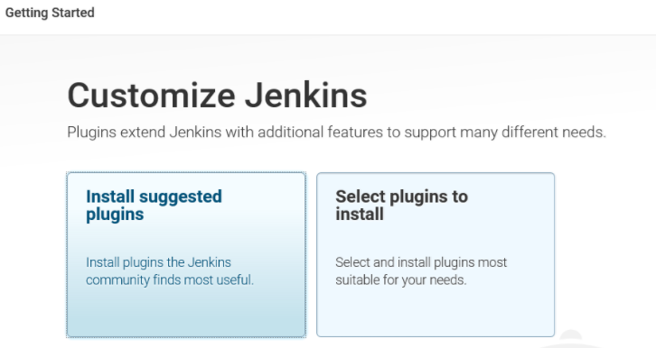 
- 插件安装完成后，要创建第一个用户，我用的test，选着as admin 
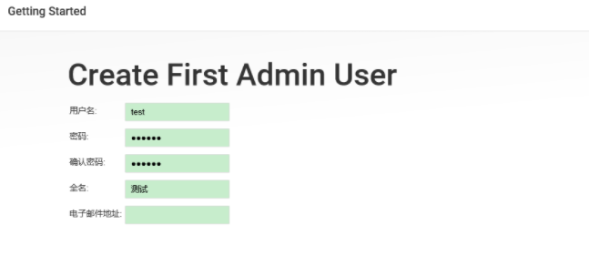 
- 创建完成，准备使用，点击start using jenkins 
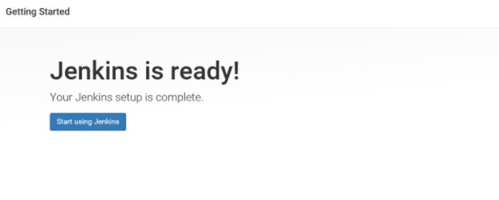 
- 为了避免端口号冲突，可以修改端口号，在jenkins安装文件中找到jenkins.xml这个文件，修改端口号，我设置的是6060 
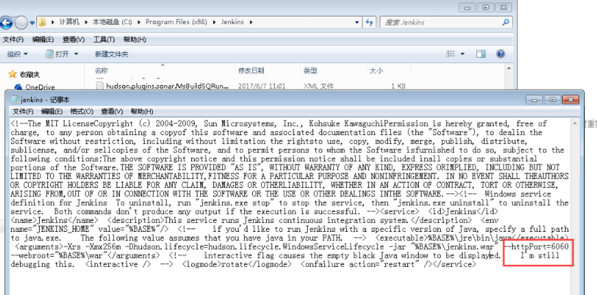 
- 配置sonar和jdk 
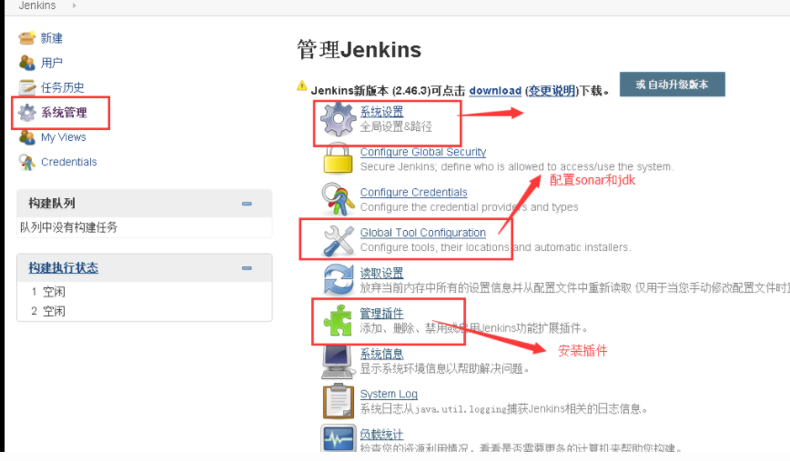 
- 配置jdk 
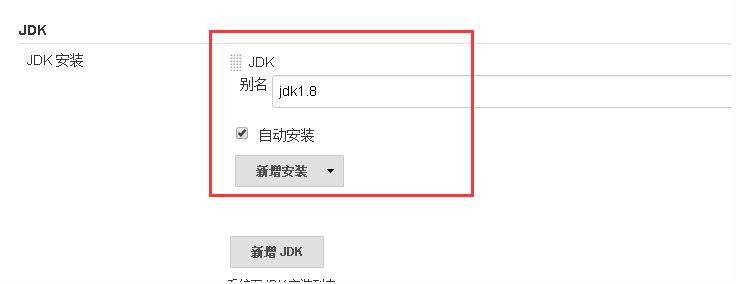 
- 配置sonar之前要去下载插件，安装着两个插件 
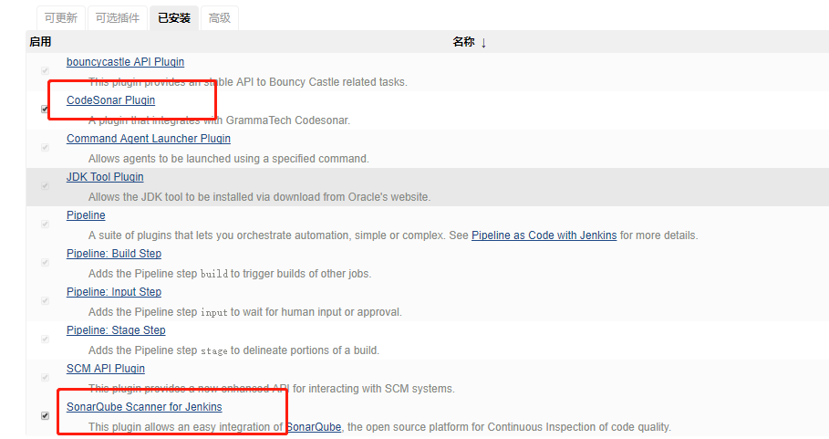 
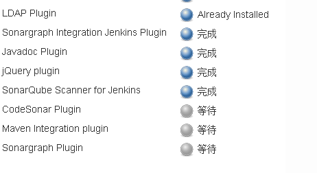 
- 安装好了以后，再去(Global Tool Configuration，即上面设置JDK面板中)安装sonar scanner 
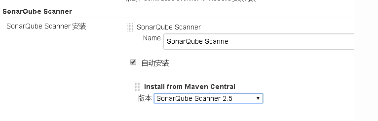 
- 进入系统设置，选着SonarQube servers，操作后，保存 
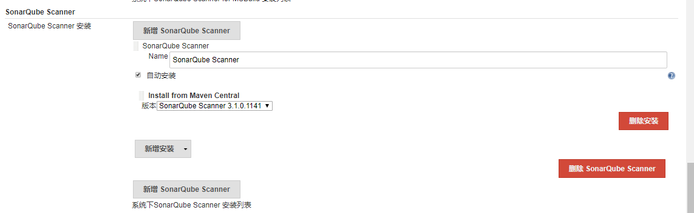 

# 2 新建项目配合Sonar进行测试
- 新建一个自由风格的项目，在项目设置里面,git资源路径，添加用户 
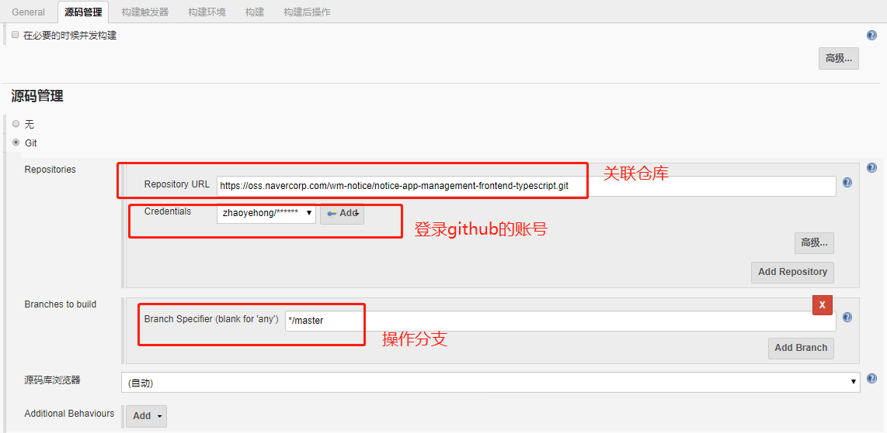 
- 在项目里设置构建操作，设置好后保存 
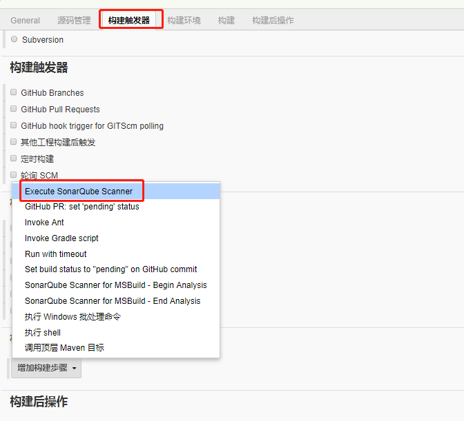 
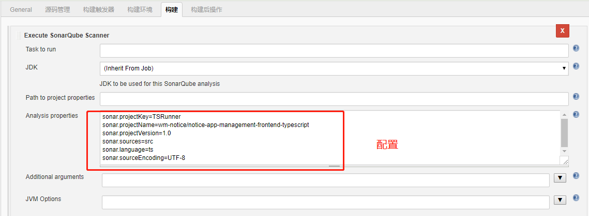 
- 保存
- 点立即构建，看控制台输出 
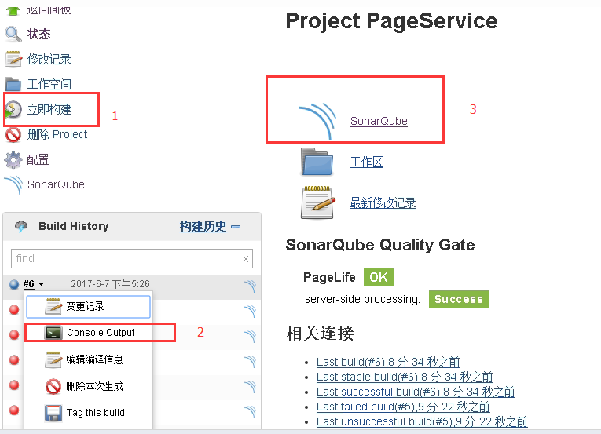 
如果构建是红色的圆点，在控制台输出里面查看。 输出成功页面： 
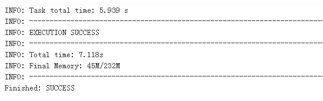 
成功后，点击sonarqube查看结果： 
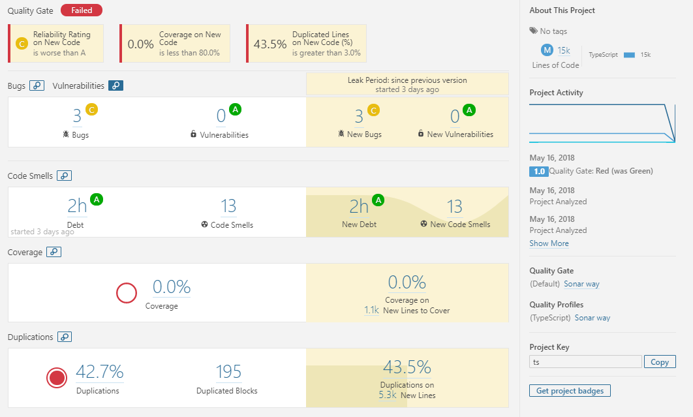 

# 注意点
需要特别注意的是，sonaqube的官方文档里并未说明和jenkins搭配需要用与jenkins使用的jdk版本一致，jenkins插件sonar scanner runner的版本也要和sonarqube server的版本的匹配，若不匹配，就是会有各种奇芭问题出现，让你百撕不得骑姐。 