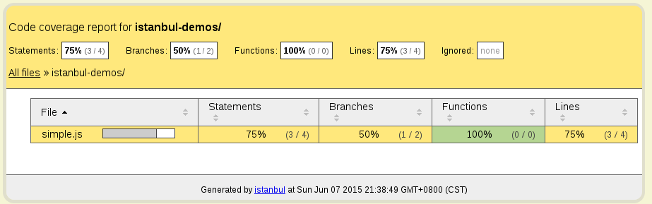
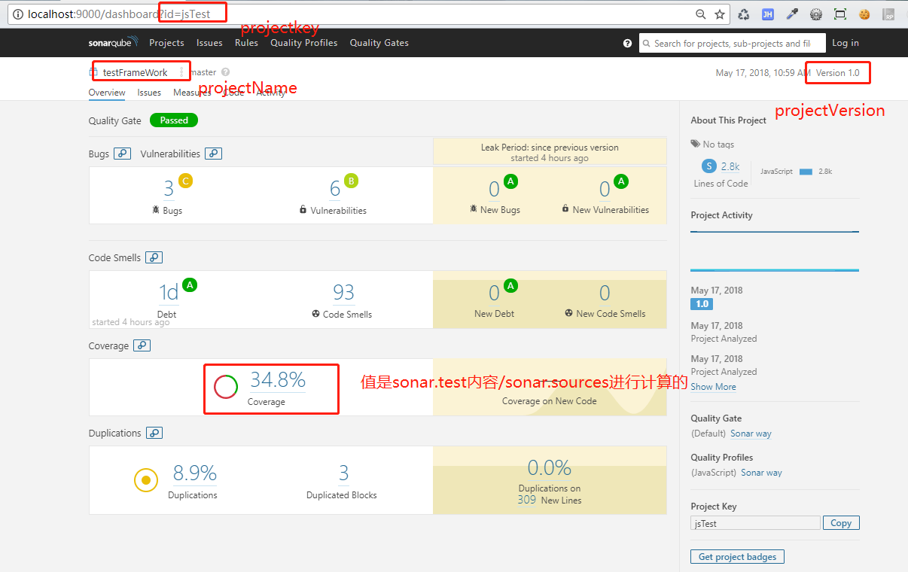
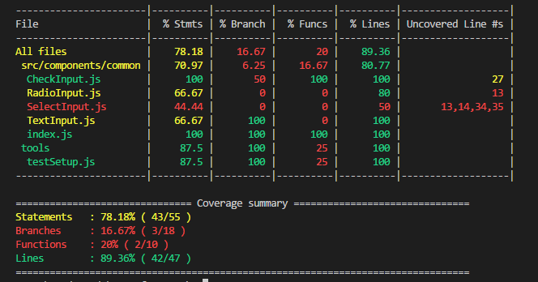
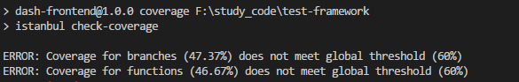
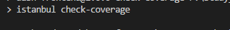
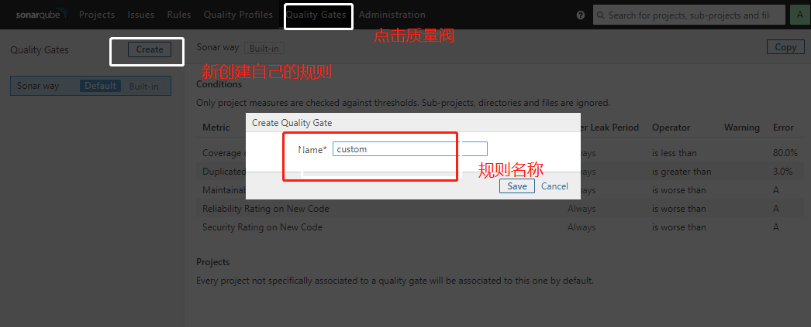
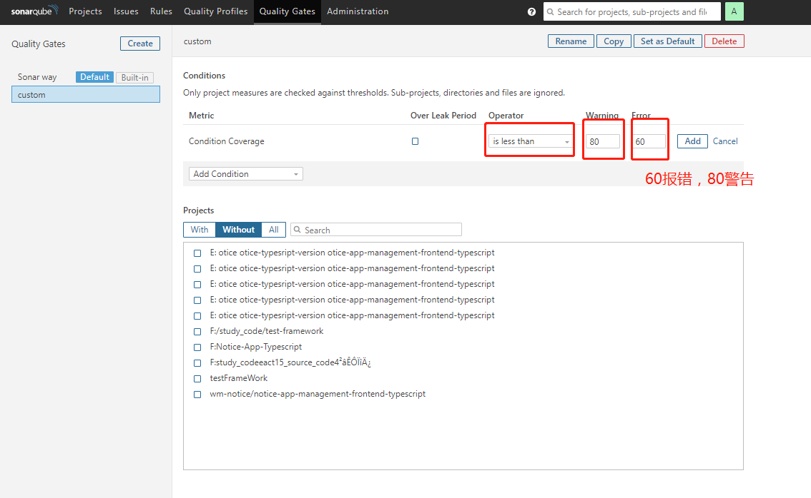
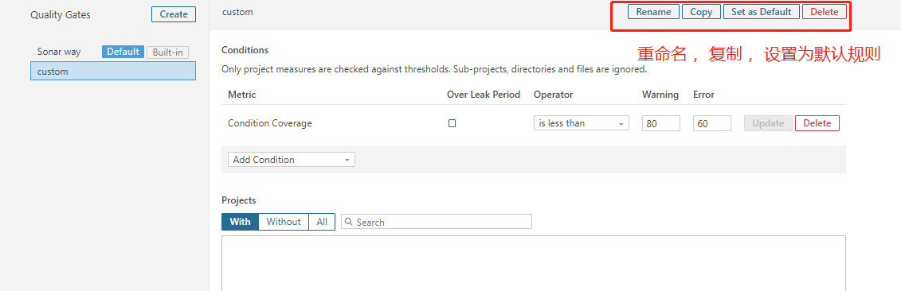

在上面的分析中，看到了Sonarqube中的Converage是0.0%。为什么呢？在code目录中，我们是对React项目进行的测试(Mocha+chian+Enzyme)。通过这个我们来进行测试代码覆盖率的分析。代码覆盖率（code coverage）测量的四个维度：
- 行覆盖率（line converage）: 是否每一行都执行了
- 函数覆盖率（function coverage）: 是否每个函数都调用了
- 分支覆盖率(branch coverage): 是否每个if代码块都执行了
- 语句覆盖率(statement coverage): 是否每个语句都执行了
我们使用的覆盖率的工具是istanbul。
# 1 安装
```javascript
npm install -g istanbul@v1.1.0-alpha.1 // 全局的，我安装的时候最新的是0.4.5,会报错误，所以安装了alpha版本
```
# 2 覆盖率测试
被测试文件名为test.js
```javascript
var a = 1;
var b = 1;
if ((a + b) > 2) {
  console.log('more than two');
}
```
使用命令测试 `istanbul cover`,在控制台得到覆盖率：
```javascript
===== Coverage summary =====
Statements   : 75% ( 3/4 )
Branches     : 50% ( 1/2 )
Functions    : 100% ( 0/0 )
Lines        : 75% ( 3/4 )
=============================
```
返回结果显示，test.js 有4个语句（statement），执行了3个；有2个分支（branch），执行了1个；有0个函数，调用了0个；有4行代码，执行了3行。
这条命令同时还生成了一个 coverage 子目录，其中的 coverage.json 文件包含覆盖率的原始数据，coverage/lcov-report 是可以在浏览器打开的覆盖率报告，其中有详细信息，到底哪些代码没有覆盖到。
<br>

# 3 覆盖率门槛
完美的覆盖率当然是 100%，但是现实中很难达到。需要有一个门槛，衡量覆盖率是否达标。`istanbul check-coverage` 命令用来设置门槛，同时检查当前代码是否达标.
```javascript
istanbul check-coverage --statement 90

ERROR: Coverage for statements (75%) does not meet global threshold (90%)
```
上面命令设置语句覆盖率的门槛是 90% ，结果就报错了，因为实际覆盖率只有75%。除了百分比门槛，我们还可以设置绝对值门槛，比如只允许有一个语句没有被覆盖到。
```javascript
istanbul check-coverage --statement -1
```
设置了3个覆盖率门槛：5个语句、3个 if 代码块、100%的函数。注意，这三个门槛是"与"（and）的关系，只要有一个没有达标，就会报错。
```javascript
istanbul check-coverage --statement -5 --branch -3 --function 100
```

# 4 与Mocha，Sonar集合
在code目录下， 运行下面的语句，会生成coverage目录
- 其中有一个lcov-report目录，该目录时覆盖率统计的html。何以直接查看覆盖率。
- 有一个lcov.info，该文件配合sonar，可以在sonar中显示覆盖率
```javascript
"cover": "istanbul cover node_modules/mocha/bin/_mocha -t 2000000 --compilers js:babel-register --recursive tools/testSetup.js test/**/*.spec.js",
```
这里详细讨论第二种，结合lcov.info，在sonar系统中进行显示。
为项目配置sonar-project.properties文件
```javascript
// 项目key值，唯一的
sonar.projectKey=jsTest
// 项目名称
sonar.projectName=testFrameWork
// 版本
sonar.projectVersion=1.0
// 分析目录
sonar.sources=src
// 分析语言(js, ts, web, java,python)
sonar.language=js
// 分析语言
sonar.sourceEncoding=UTF-8
// 测试用例的目录
sonar.tests=test
// 目录下应该执行的测试文件
sonar.test.inclusions= **\*.spec.js
// 指定上面生成的lcov.info文件(覆盖率文件)
sonar.javascript.lcov.reportPaths=coverage\lcov.info
```
访问sonar系统可以看到：<br>


# 配置Istanbul
istanbul相关的执行参数，可以在命令行下执行时传递参数来制定，也可以在yaml格式的.istanbul.yml文件中配置。简单贴出一些重要的配置项.
```javascript
instrumentation:
  root: F:\study_code\test-framework\  # 执行的根目录
  extensions:
    - .js   # 检查覆盖率的文件扩张名
  excludes: ['**/node_modules/**']

reporting:
  print: summary
  reports: [lcov, text, html, text-summary] # 生成报告的格式： 
  dir: ./coverage   # 生成报告保存的目录
  watermarks:       # 在不同覆盖率下会显示使用不同颜色（60-95使用该颜色）
    statements: [60, 80]
    branches: [60, 80]
    lines: [60, 80]
    functions: [60, 80]
check:
  global:
    statements: 60
    branches: 60
    lines: 60
    functions: 60
```
运行测试：npm run cover:<br>
<br>

检测覆盖率是否达到要求(添加到package.json中)：
```javascript
"coverage": "istanbul check-coverage"
```
运行 npm run coverage:因为上面配置的是60才能通过，所以抛出错误。<br>
<br>
如果我们将通过范围设置的小一点，覆盖率达到要求，执行命令的时候就不会有任何信息：<br>
<br>

# 在sonar系统中配置覆盖率
找到Quality Gates => create => 输入name<br>
<br>
选择condition Coverage => 填写提示规则<br>
<br>
可以对规则进行增删改，设置为默认操作：<br>
<br>