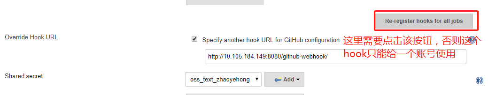

近几年，伴随着前端技术日新月异的发展，前端开发中前后端分离，工程化，自动化等现代化的开发模式越来普及，前端项目也引入了编译，构建，单元测试等现代软件工程化的标准环节。这样大提高了前端的开发效率和业务交付能力。但是，在代码集成，项目部署阶段，我们还需要引入 CI / CD 等现代化的软件开发实践，来减少风险和重复过程，节省我们的时间.

如果没有 CI/CD， 我们的前端从开发到提测工作流程可能如下,这个流程中，每一个步骤都要重复人工操作，很大增加了时间成本，不能保证操作的准确性。对于 unit 或者 build 的结果，没有一个自动的反馈机制，需要人工 check 运行结果，最后部署也是人工登录服务器执行脚本，非常繁琐：
- 本地机器上写代码
- 在命令行输入 npm run unit，查看单元测试结果
- 提交代码，push 到 git 远程仓库
- 登录测试服务器，拉取代码，执行 npm run build，构建项目
- 如果测试服务器是基于 pm2 的 proxy server，还需要重启 server


引入 CI/CD 以后，整个流程变成如下步骤，在 CI/CD 流程中，只有步骤1和步骤2需要人工操作，其他步骤都是自动运行，是一个非常标准化的流程，减少了人工操作的风险，省去了重复性工作，增强了项目的可见性。接下来我们将通过配置 jenkins 和 gihub webhook 来实现这个流程：
- 本地机器上写代码
- 提交代码，push 到 git 远程仓库
- git hook 触发 jenkins 的构建 job （自动）
- jenkins job 中拉取项目代码，运行 npm run unit 和 npm run build，如果失败，发送邮件通知相关人。（自动）
- jenkins job 中执行测试服务器的部署脚本 （自动）<br>
<br>

# 1 github secret text 生成
sercret text： 此处需要一个对项目有写权限的账户

进入github --> setting --> Developer settings => Personal Access Token --> Generate new token <br>

<br>

点击add会生成一个tokens.自己先保存此token，如果丢失，之后再也无法找到这个token。需要重新再创建。

<br>

# 2 jenkins 生成webhook
在jenkins的配置中，找到gitHub Servers, 点击高级按钮：<br>
<br>
按照下面的操作选择,最后生成hook 的url。<br>
<br>
<br>
# 3 GitHub webhooks 设置
进入GitHub上指定的项目 --> setting --> WebHooks&Services --> add webhook --> 输入刚刚部署jenkins的服务器的IP<br>
<br>

# 4 创建一个freestyle任务
- General 设置 填写GitHub project URL, 也就是你的项目主页 eg. https://github.com/your_name/your_repo_name<br>
<br>
- 配置源码管理<br>
<br>
- 填写项目的git地址, eg. https://github.com/your_name/your_repo_name.git
- 添加github用户和密码
- 选择githubweb源码库浏览器，并填上你的项目URL，这样每次构建都会生成对应的changes，可直接链到github上看变更详情

# 5 错误备注
- linux 的git版本如果过低，会抛出异常（ERROR: Couldn't find any revision to build. Verify the repository and branch configuration for this job.）
- git 版本安装正确后，在（全局工具配置）里面的git选项，设置`Path to Git excutable`的路径为安装的git路径。该git的路径设置应该在linux上执行`whereis git`命令后获取到的git路径，而不是你文件放置的位置：<br>
<br>

# 6 github 的PR自动构建
## 6.1 安装配置插件
之前的配置，都是向master分支push操作触发jenkins进行构建，但是在一般的正常工作中，不会允许程序员直接向主分支推送代码；正常都是fork一个本地的分支，在本地分支调试完后，向主干分支提交pull request，待相关的管理人员进行review后，才merge到master分支；
基于此，我们之前的配置就有点不合适了，接下来我们就一块研究下如何在别人提交pull request时，就自动触发构建，当然这个构建要执行的任务，应该是将新提交的代码获取到服务器，并部署到环境当中，这应该是一些基本的操作，不懂就问下别人你们的环境如何部署；这里我们主要看如何配置jenkins能使pull request触发构建
- 安装pull request builder plugin插件
- 配置pull request builder plugin插件<br>
<br>
1. GitHub Server API URL：　　如果不是使用的企业版jenkins，就保持默认的https://api.github.com；
1. Jenkins URL overrde：　　如果考虑到防火墙、跨域等问题，可以写一个替换连接jenkins主页的url；
1. Shared secret：　　如果填写一个密码，则每一个提交的pull request都需要验证这个密码才能连接jenkins；
1. Credentials：　　选择我们之前用github生成的token创建的认证身份；一般这个身份在github中具有较高的权限；
- 完后点击下方的测试链接，来测试jenkins与github的基本连接以及身份用户的权限验证.其中Repository ownere/name，顾名思义就是填写github的用户名跟远程库名，中间有反斜杠/；在Description写一个这个Credentials的描述，以区分将来不同Credentials<br>
<br>
- 下面Admin list中填写github用户白名单，在白名单中的用户提交pull request，可以直接触发构建，没有在白名单中的，需要通过admin的确认(多个账号需要使用空格隔开)<br>
<br>
- 点击 “构建” 选项，再点击 “增加构建步骤”， 选择 “Execute shell”，配置构建命令。 如下，这里配置了 cnpm install、npm run unit、npm run build, 分别做安装依赖、单元测试、编译打包三件事。<br>
<br>
- 点击 “构建后操作” 选项，添加两个构建后操作步骤<br>
<br>
- ok，配置完后点击保存.
## 6.2 配置jenkins任务(这里只说部分不一样的)
-  源码管理，基本配置搞定后，点击高级：
　　Name： origin
　　Refspec：+refs/pull/*:refs/remotes/origin/pr/*
　　Branch Specifier： 填写${sha1}，如果想要用到提交的pr，则这个地方填写${ghprbActualCommit}。[我使用了变量不行会报错，我直接设置了全部分支]

官网描述:
```javascript
Under Advanced, set Name to origin and:
If you just want to build PRs, set refspec to +refs/pull/*:refs/remotes/origin/pr/*
If you want to build PRs and branches, set refspec to +refs/heads/*:refs/remotes/origin/* +refs/pull/*:refs/remotes/origin/pr/* (see note below about parameterized builds)
In Branch Specifier, enter ${sha1} instead of the default */master.
If you want to use the actual commit in the pull request, use ${ghprbActualCommit} instead of ${sha1}
```
<br>

- 构建触发器<br>
如果插件安装正常，构建触发器这边会有GitHub Pull Request Builder，不要选择之前的push触发的那个咯；下面的credentials选择下拉框给出的就好，应该就是之前在系统设置中测试通过的那个；
Admin list填写对于这个job要加入白名单的github用户；下面的Use github hooks for build triggering勾选；<br>
<br>
- github hook中设置Pull request方式<br>
<br>