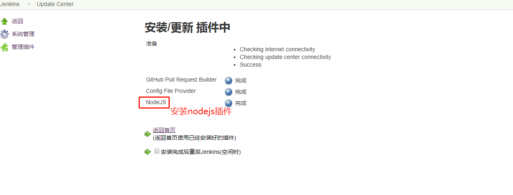
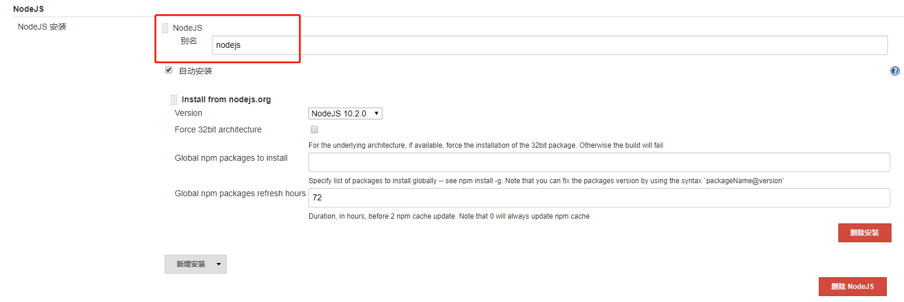
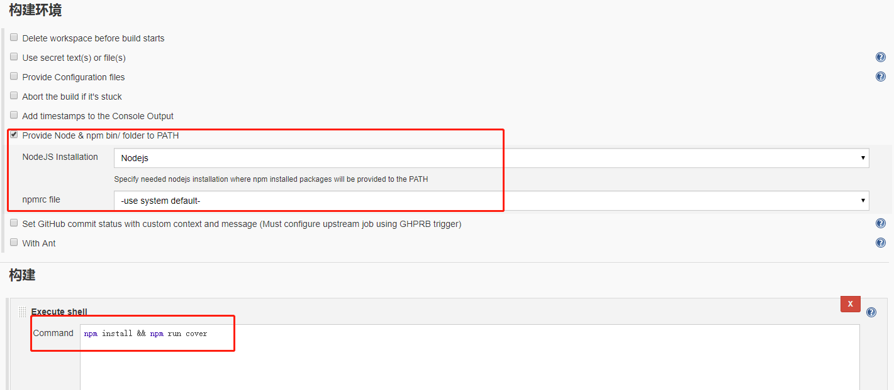

# 1 linux 安装nodejs
先安装，nvm，即是Node Version Manager(Node版本管理器)
```javascript
curl -o- https://raw.githubusercontent.com/creationix/nvm/v0.33.2/install.sh | bash
```
 或者使用  wget
 ```javascript
 wget -qO- https://raw.githubusercontent.com/creationix/nvm/v0.33.2/install.sh | bash
 ```
之后需要激活nvm:
```javascript
source ~/.nvm/nvm.sh
```
激活完成后，安装node
```javascript
nvm install node 
```
安装完成后，切换到该版本
```javascript
nvm use node
```
设置淘宝镜像
```javascript
npm install -g cnpm --registry=https://registry.npm.taobao.org  
```

# 2 jenkins安装nodejs插件
<br>
进入Global Tool Configuration，这里可以配置Git（如果安装了插件的话）、Maven、Ant、Gradle、NodeJS等工具。选择NodeJS一栏，勾选自动安装，选择版本，Save即可。注意这里可以安装数个不同的NodeJS版本，直接新加就行，然后在构建项目的时候选择不同的NodeJS版本。
- 注意：我在这里选择了nodejs.10版本,失败了。可能时当前jenkins还不支持。
<br>

新建项目`构建环境`模块：
注意这里需要选择“Provide Node & npm bin/ folder to PATH”，并在下面选择上面步骤安装的NodeJS对应版本。否则会由于找不到npm命令的错误而构建失败。
在项目中添加你需要执行的命令：
<br>
